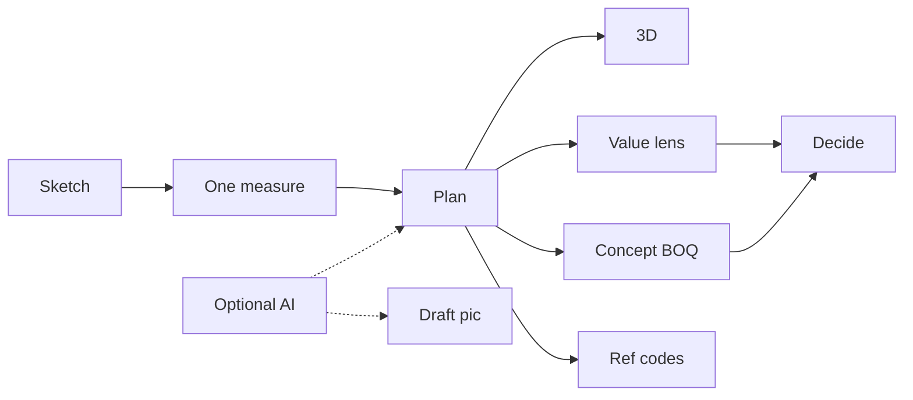

*Hand-drawn: a mentor and a learner at one desk, sunlight cutting a tropical plan. The paper stays blank of titles so the illustration is the craft, not a HUD.*

# Luma House

**A local-first sketch-to-decision studio for a home — draw a room, give it one real measure, and read light, air, escape, heat, and a concept cost in the same geometry.**

[](LICENSE)

By [Non Arkaraprasertkul](https://github.com/Nonarkara) ([@Nonarkara](https://github.com/Nonarkara)) — [Axiom X Co., Ltd.](https://github.com/Nonarkara/Axiom), Bangkok.

Independent civic-studio work. This repository is **not** a depa, municipal, or vendor product.

The GitHub repo stays `luma-house` (GitHub Pages path inertia). The in-product name is **designon** (Design + Non). Both names refer to this tree.

---

## What this is

A Vite + React + TypeScript browser prototype. You draw rooms with a mouse or finger, type one known width or depth, and the whole sketch receives a shared scale. That same geometry drives:

- 2D plan editing (rooms, windows, doors, furniture, tape measure)
- lazy-loaded 3D massing and an optional walk-through
- a **Value Lens** for daylight reach, shade, airflow, escape connectivity, and envelope heat
- living checks, climate what-ifs, A/B comparison, and a guided tour
- a concept bill of quantities that responds to area, openings, and systems
- conservative **reference** checks against IBC / ASHRAE / ADA / ISO thresholds (labels, not a permit)

The bundled sample is **South Light 50 · 向阳之家** — a 50.0 m² Shanghai apartment. Starting blank or tracing a plan creates an untitled sketch and does **not** inherit that sample’s variants or style language.

Optional cloud (off by default): AI plan-trace and concept imagery, both labeled as drafts, sharing a browser-visible three-use daily quota. The worker lives in `workers/concept-render/`. Keys stay in the operator’s environment.

Persistence is `localStorage`. `data/schema.sql` is a prototype SQLite sketch for later sync — it is not a running database in this app. Analytics is a local pageview queue.

**This repo is not:**

- A CAD package, energy model, moisture analysis, CFD tool, or procurement system
- A fire, accessibility, or jurisdictional approval
- A live municipal service or an official ranking of homes or cities
- A dump of API keys, worker hostnames, analytics tokens, or spreadsheet IDs

Related studio writing: the [Axiom Design Core](src/design/AxiomCore.md) in this tree, and the public [Axiom-Design-Core](https://github.com/Nonarkara/Axiom-Design-Core) repo.

---

## Philosophy

Fork the **method**, not the secrets. Take the calibration math, the Value Lens grammar, the honest labels, and the test file that locks them. Leave `GEMINI_API_KEY`, worker URLs, and any host you actually deploy on in *your* environment.

This is a **one Mac** product. `npm install` and `npm run dev` are the whole studio. There is no cluster, no ranking farm, and no vendor platform to rent.

There are **no black-box scores**. Daylight is a window-centered reach zone. Ventilation needs two real exterior pressure faces connected by modeled open doors. Escape is a door-graph, geometry only. Envelope heat is a steady-state walls-and-openings comparison. Cost is a concept allowance, not a quote. When a number is directional, the UI is supposed to say so. See the [building-science usability audit](docs/BUILDING_SCIENCE_USABILITY_AUDIT.md).

The studio audience is **bilingual Thai–English**. This tree’s workspace copy is English; Axiom Core reserves IBM Plex Sans Thai for body type. The included sample is a Shanghai apartment with a Chinese name. Do not invent a Thai UI that is not in the source.

Company: **Axiom X Co., Ltd.** Author: **Non Arkaraprasertkul** (Nonarkara).

---

## Ethical use

These models exist so a person can test an idea before concrete is poured. They are not a substitute for a licensed professional, a weather file, or a local code official.

**Do**

- Keep science labeled: measured, modeled, reference-only, or geometry-only.
- Confirm AI traces and concept pictures yourself. The product rule is human-confirmed drafts, not marketing renders.
- Put optional cloud keys in environment variables or `wrangler secret`. Never in Vite client env, git, or this README.
- Attribute the method when you fork it. Keep the disclosure next to the number.
- Treat IBC / ASHRAE / ADA / ISO badges as conservative teaching references. Raise the numbers if a local code is stricter.

**Do not**

- Present a Value Lens verdict as a load calculation, AC size, payback, or building permit.
- Ship mock science as a live professional result, or hide an empty model behind a success state.
- Commit API keys, analytics tokens, database URLs, spreadsheet IDs, or a real `GEMINI_API_KEY`.
- Imply depa, a municipality, or a standards body publishes or certifies this prototype.
- Use the optional concept worker to invent a house that does not exist and call it a photograph of a built project.

If a contribution only works by pasting a secret, it does not belong here.

---

## How to use / learn

```bash
npm install
npm run dev          # Vite workspace
npm test             # plan, solar, energy, budget, and related checks
npm run lint
npm run build        # typecheck + production bundle
npm run preview
```

Node 20 is what the GitHub Pages workflow uses.

A learner path that matches the code:

1. Draw a rough room, or open the 50 m² sample, or upload a plan image to trace (trace needs the optional worker).
2. Calibrate from one known width or depth (`src/plan.ts`, napkin scale in `src/canvas/`).
3. Place windows and doors. Watch the Value Lens update on the same geometry.
4. Orbit or walk the lazy-loaded 3D mass (`src/canvas/Spatial3D.tsx`).
5. Scrub sun / time / outdoor temperature, or pick an explicit climate scenario.
6. Read concept cost, interiors BOQ, and the standards badges. Export or share via URL hash (`src/sharePlan.ts`).

Optional concept worker (only if you want drafts):

```bash
cd workers/concept-render
npm install
# wrangler secret put GEMINI_API_KEY   # your key, your account
```

Set `VITE_CONCEPT_API_URL` to **your** worker URL when you rebuild. `.env.example` shows the placeholder shape. Do not copy a hostname from someone else’s machine.

Deploy targets in this tree: GitHub Pages (`.github/workflows/deploy.yml`, site path `nonarkara.github.io/luma-house`) and optional Render static hosting (`render.yaml`). This working tree is not a promise that a given host is up.

| File | What to read |
|---|---|
| `src/plan.ts` | Scale, solar math, energy and BOQ hooks |
| `src/analysis/` | Daylight, wind, heat, egress, air, energy — each with tests |
| `src/codes/` | Reference standards as data, not law |
| `src/journey/` | Draw → model → sun → living → systems → cost → picture |
| `src/design/AxiomCore.md` | Tokens, subtraction, one citron accent |
| `docs/BUILDING_SCIENCE_USABILITY_AUDIT.md` | What the models may and may not claim |

---

## System diagram



Browser only for the default path. `localStorage` holds the draft. 3D loads when asked. The worker is a side door.

---

## License / contributing

This repository is licensed under the [MIT License](LICENSE). Copyright © 2026 Non Arkaraprasertkul / Axiom X Co., Ltd.

Reuse the method, the models, and the prose with attribution. MIT covers **this tree**. It does not relicense IBC, ASHRAE, ADA, or ISO text, nor any cloud model you call from the optional worker.

PRs against `main` are welcome when they keep calculations outside UI, add tests for domain changes, and stay honest about fidelity. Do not add secrets, invented metrics, or a fake live URL.

If you build a house-sketching tool from this method, the studio would like to see it.
